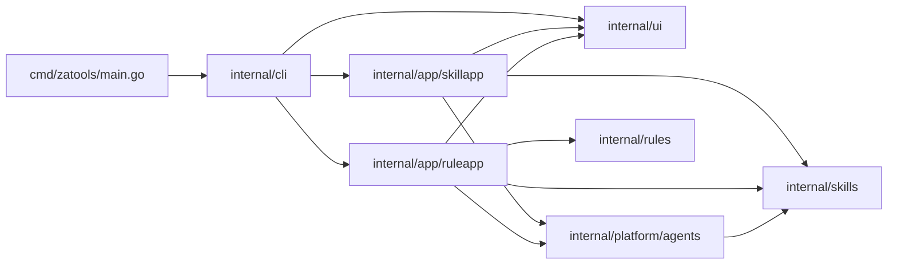
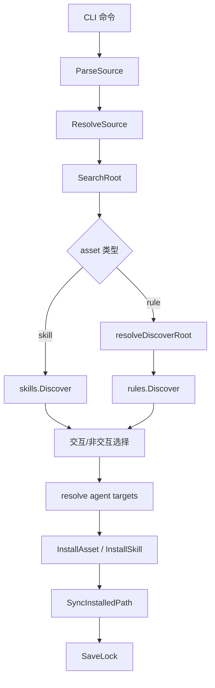

# zatools

`zatools` 是一个 Go 编写的 CLI，用来把可复用的 `skill` 和 `rule` 资产安装到不同 AI Agent 的约定目录中，并维护锁文件、更新检查和多 Agent 同步。

当前代码库已经实现两类可安装资产：

- `skill`
- `rule`

同时也内置了 Agent 安装目录编排能力，但要注意：

- `agent` 在当前代码里是“安装目标”的概念，不是可被发现和安装的独立资产类型
- `command` 和 `hook` 目前还没有对应的 CLI 子命令、扫描器、识别规则和安装逻辑

如果你要给别人编写可被 `zatools` 正确发现的 skill 或 rule，这份 README 里“发现规则”和“识别条件”两节最重要。

## 当前支持矩阵

| 类型 | 角色 | 当前状态 | CLI 入口 | 说明 |
| --- | --- | --- | --- | --- |
| `skill` | 可安装资产 | 已支持 | `zatools skill ...` | 支持发现、列出、安装、删除、检查更新、更新、模板初始化 |
| `rule` | 可安装资产 | 已支持 | `zatools rule ...` | 支持发现、列出、安装、删除、检查更新、更新 |
| `agent` | 安装目标目录编排 | 已支持 | `--agent` | 当前支持 `codex`、`cursor`、`claude` |
| `command` | 可安装资产 | 未实现 | 无 | 当前代码没有 `AssetKind`、扫描器、CLI 子命令 |
| `hook` | 可安装资产 | 未实现 | 无 | 当前代码没有 `AssetKind`、扫描器、CLI 子命令 |

补充说明：

- 当前 `AssetKind` 只有两种：`skill` 和 `rule`
- `skill` 支持项目级和全局级安装
- `rule` 目前只支持项目级安装，不支持全局安装
- `rule` 目前只支持安装到 `cursor` 和 `claude`，不支持 `codex`

## 快速开始

### 构建与运行

```bash
go build ./cmd/zatools
go run ./cmd/zatools --help
```

### 常用验证命令

```bash
go test ./...
go test -race ./...
go vet ./...
```

## CLI 总览

当前顶层命令只有 3 个：

```text
zatools
├── skill
│   ├── add
│   ├── list
│   ├── init
│   ├── remove
│   ├── check
│   └── update
├── rule
│   ├── add
│   ├── list
│   ├── remove
│   ├── check
│   └── update
└── completion
    ├── bash
    ├── zsh
    ├── fish
    └── powershell
```

### `skill` 命令

```bash
zatools skill add <source> [--agent codex,cursor,claude] [--global] [--list] [--skill <name>] [--yes]
zatools skill list [--global]
zatools skill init [name]
zatools skill remove [skills...] [--skill <name>] [--all] [--global] [--yes]
zatools skill check [--global]
zatools skill update [--global]
```

示例：

```bash
# 查看某个来源里能发现哪些 skill，但不安装
zatools skill add ./examples/skills --list

# 从本地目录安装指定 skill 到 Codex 和 Cursor
zatools skill add ./examples/skills --skill golang-pro --agent codex --agent cursor

# 从 GitHub shorthand 安装
zatools skill add owner/repo

# 从 GitHub 仓库的子目录安装
zatools skill add owner/repo/skills/backend

# 指定分支或标签
zatools skill add owner/repo#main

# 安装到全局
zatools skill add ./examples/skills --global --yes

# 初始化一个 skill 模板
zatools skill init my-skill
```

### `rule` 命令

```bash
zatools rule add <source> [--agent cursor,claude] [--list] [--rule <name>] [--yes]
zatools rule list
zatools rule remove [rules...] [--rule <name>] [--all] [--yes]
zatools rule check
zatools rule update
```

示例：

```bash
# 先看规则是否能被发现
zatools rule add ./examples/rules --list

# 安装指定 rule 到 Cursor
zatools rule add ./examples/rules --rule common/engineering --agent cursor

# 安装全部发现到的 rule 到 Claude 和 Cursor
zatools rule add ./examples/rules --yes

# 从远端仓库安装
zatools rule add https://github.com/example/team-rules/tree/main/rules
```

### `completion` 命令

```bash
zatools completion bash
zatools completion zsh
zatools completion fish
zatools completion powershell
```

## 来源格式

`skill add` 和 `rule add` 共用同一套来源解析器。当前支持的来源格式如下：

| 格式 | 示例 | 说明 |
| --- | --- | --- |
| 本地目录 | `./skills` | 目录会先被转成绝对路径 |
| GitHub shorthand | `owner/repo` | 自动解析成 `https://github.com/owner/repo.git` |
| GitHub shorthand + 子目录 | `owner/repo/skills/demo` | 子目录会作为扫描根目录 |
| GitHub URL | `https://github.com/owner/repo` | 支持普通仓库链接 |
| GitHub tree URL | `https://github.com/owner/repo/tree/main/skills/demo` | 自动提取 `ref=main` 和 `subpath=skills/demo` |
| GitLab URL | `https://gitlab.com/group/repo` | 支持普通仓库链接 |
| GitLab tree URL | `https://gitlab.com/group/repo/-/tree/main/skills/demo` | 自动提取 `ref` 和 `subpath` |
| 直接 git URL | `https://example.com/repo.git` | 走通用 git clone 流程 |
| 带引用名 | `owner/repo#main` | `#` 后面会当作分支、标签或提交哈希 |

额外细节：

- `github:owner/repo` 会被转成 GitHub shorthand
- `gitlab:group/repo` 会被转成 GitLab URL
- 当前内置了一个别名：`coinbase/agentWallet -> coinbase/agentic-wallet-skills`
- 如果 `ref` 看起来像提交哈希，clone 后会再 `fetch` 并 `checkout --detach FETCH_HEAD`
- 子路径会经过安全校验，禁止绝对路径和 `..` 越界
- `#ref@subpath` 这种 fragment 写法里，当前实现只消费 `ref`，不会消费 `@subpath`

## Agent、作用域与安装路径

### Skill 安装路径

| Agent | 项目级 | 全局级 |
| --- | --- | --- |
| `codex` | `.agents/skills` | `~/.codex/skills` |
| `cursor` | `.cursor/skills` | `~/.cursor/skills` |
| `claude` | `.claude/skills` | `~/.claude/skills` |

### Rule 安装路径

| Agent | 项目级 | 全局级 |
| --- | --- | --- |
| `cursor` | `.cursor/rules` | 不支持 |
| `claude` | `.claude/rules` | 不支持 |
| `codex` | 不支持 | 不支持 |

### 锁文件位置

| 场景 | 锁文件路径 |
| --- | --- |
| 项目级 | `<project-root>/.zatools-lock.json` |
| 全局级 skill | `~/.agents/.zatools-lock.json` |

### 项目根目录如何判定

项目级操作不是简单地使用当前 shell 所在目录，而是会向上查找项目根目录。只要某一层命中以下任一标记，就会把该目录视为项目根：

- `.git`
- `.jj`
- `.hg`
- `go.mod`
- `package.json`
- `pyproject.toml`
- `Cargo.toml`
- `Gemfile`
- `.agents`
- `.cursor`
- `.claude`

如果一直向上都没有命中任何标记，则回退使用当前工作目录。

## 代码架构

### 分层架构



### 职责说明

| 目录 | 职责 |
| --- | --- |
| `cmd/zatools` | CLI 入口 |
| `internal/cli` | Cobra 命令树、flags、help、completion |
| `internal/app/skillapp` | skill 的应用层编排：解析来源、发现、选择、安装、删除、检查更新、更新 |
| `internal/app/ruleapp` | rule 的应用层编排：解析来源、发现、选择、安装、删除、检查更新、更新 |
| `internal/skills` | 通用核心能力：来源解析、clone、本地路径校验、workspace、锁文件、拷贝、哈希、同步 |
| `internal/rules` | rule 的发现与元数据解析 |
| `internal/platform/agents` | 各 Agent 在 project/global 作用域下的安装目录映射 |
| `internal/ui` | TUI/终端输出、本地化文案、选择器、帮助模板 |

### 运行流程



## Skill 的发现与识别规则

这一节是编写 skill 仓库时最关键的约束。

### 发现入口

`skill add <source>` 的发现根目录来自：

1. `ParseSource`
2. `ResolveSource`
3. `ResolvedSource.SearchRoot()`

具体规则：

- 如果来源没有 `subpath`，就从来源根目录开始递归扫描
- 如果来源带了 `subpath`，就只从该子目录开始扫描
- `subpath` 不能是绝对路径，也不能包含 `..`

### 一个目录会在什么条件下被识别为 skill

一个目录要被识别为 skill，必须同时满足：

1. 目录中存在一个文件名精确为 `SKILL.md`
2. `SKILL.md` 第一行必须是 `---`
3. 开头 `---` 之后读到的 frontmatter YAML 必须能被正确解析

只要满足这些条件，该目录就会被视为一个完整 skill 包。

建议始终使用标准 frontmatter 形式：

```yaml
---
name: my-skill
description: Explain when this skill should be used
---
```

### `SKILL.md` frontmatter 规则

当前实际消费的字段只有两个：

```yaml
---
name: my-skill
description: Explain when this skill should be used
---
```

识别规则如下：

- `name` 存在时，skill 名称就是 `name`
- `name` 缺失时，回退为 `SKILL.md` 所在目录名
- `description` 存在时，使用 `description`
- `description` 缺失时，回退为 `没有相关信息`
- 其他 frontmatter 字段即使存在，也不会影响发现和安装

### skill 递归扫描规则

扫描是递归的，但有两个重要约束：

- 如果某个目录命中了 `SKILL.md`，这个目录会被当作一个 skill 根目录
- 一旦某个非根目录被识别为 skill，它的子目录不会继续向下扫描

这意味着：

- 允许一个来源根目录下有多个 skill
- 允许来源根目录本身就是一个 skill
- 如果某个子目录已经是一个 skill，那么它内部嵌套的 `SKILL.md` 不会再被单独发现

### skill 扫描时会跳过哪些目录

在递归扫描中，以下目录名会直接跳过，不再继续向下找：

- `.git`
- `node_modules`
- `vendor`
- `.idea`
- `.vscode`

注意：

- 只有“根目录下面”的这些目录会被跳过
- 如果你把 skill 放在 `vendor/`、`node_modules/` 之类目录里，默认不会被发现

### skill 安装名如何生成

安装到目标 Agent 时，目录名不是直接使用原目录名，而是使用 `name` 的规范化结果：

- 保留字母、数字、`-`、`_`、`.`
- 其他字符会被替换成 `-`
- 连续非法字符会压缩
- 首尾的 `-` 和 `.` 会被去掉
- 如果最终为空，回退成 `unnamed-skill`

例如：

| 原始名称 | 安装目录名 |
| --- | --- |
| `Golang Pro` | `golang-pro` |
| `my.skill` | `my.skill` |
| `中文 skill` | `skill` |

### 推荐的 skill 仓库布局

```text
repo/
├── skills/
│   ├── golang-pro/
│   │   └── SKILL.md
│   └── debugging/
│       └── SKILL.md
└── examples/
```

常见安装方式：

```bash
# 扫描整个仓库里所有符合条件的 SKILL.md
zatools skill add ./repo --list

# 只扫描 skills 子目录
zatools skill add ./repo/skills --list

# 远端子目录
zatools skill add owner/repo/skills
```

### 哪些情况会导致 skill “看起来有文件，但就是没被发现”

- `SKILL.md` 文件名不匹配
- `SKILL.md` 没有以 `---` 开头的 YAML frontmatter
- frontmatter 不是合法 YAML
- 你把 skill 放进了 `.git`、`vendor`、`node_modules`、`.idea`、`.vscode`
- 你给的是错误的 source 或错误的 subpath
- 你用 `--skill` 指定的名称，与最终识别出来的 `name` 不一致

## Rule 的发现与识别规则

`rule` 的发现逻辑和 `skill` 不一样，限制更多，也更容易因为目录结构不符合规则而“发现不到”。

### rule 默认扫描根目录

当执行 `zatools rule add <source>` 时：

- 如果 `source` 没有显式 `subpath`
  - 若来源根目录下存在 `rules/` 目录，则默认只扫描 `rules/`
  - 若不存在 `rules/` 目录，则扫描来源根目录
- 如果 `source` 显式指定了 `subpath`
  - 就严格扫描这个 `subpath`
  - 不再自动追加 `rules/`

这意味着：

- `skill` 不要求必须放在 `skills/`
- `rule` 则会优先寻找 `rules/`

### 哪些文件会被认为是 rule 文件

当前只认两种后缀：

- `.md` -> 识别为 `claude` 规则文件
- `.mdc` -> 识别为 `cursor` 规则文件

以下文件不会被当作 rule 内容：

- 不是 `.md` / `.mdc` 的文件
- 元数据文件 `RULE.yaml`
- 元数据文件 `RULES.yaml`

### 一个目录如何被识别为 rule 包

`rules.Discover(root)` 的聚合方式不是“每个有规则文件的目录都算一个包”，而是：

1. 根目录自身如果包含至少一个支持的规则文件，则根目录会成为一个 rule 包
2. 根目录下的每个一级子目录：
   - 如果该子目录递归后代里至少有一个支持的规则文件
   - 那么这个一级子目录会成为一个 rule 包

非常关键的一点：

- 只有“根目录”和“根目录的一级子目录”会成为独立 rule 包
- 更深层的目录只是被归入最近的一级子目录 rule 包中

例如：

```text
rules/
├── common/
│   └── engineering.md
└── cursor/
    └── backend/
        └── style.mdc
```

这里会发现到 2 个 rule 包：

- `common`
- `cursor`

不会直接发现 `cursor/backend` 这个独立 rule 包。

### rule 的 metadata 规则

rule 元数据文件支持两个文件名：

- `RULE.yaml`
- `RULES.yaml`

metadata 有两种写法。

#### 写法 1：直接描述当前目录

适合给“当前目录就是一个 rule 包”的场景：

```yaml
name: shared-rules
description: Common engineering rules
```

这会把当前目录的名称和描述直接改掉。

#### 写法 2：在根 metadata 里描述一级子目录

适合在扫描根目录统一管理多个一级 rule 包：

```yaml
common:
  name: shared-rules
  description: Common engineering rules
cursor:
  name: cursor-style
  description: Cursor specific rules
```

这时：

- key 必须匹配扫描根目录下的一级子目录名
- value 里可写 `name` 和 `description`

#### 优先级

如果一级子目录自己也有 `RULE.yaml` 或 `RULES.yaml`，并且里面写了直接 metadata，那么它会覆盖根目录里同名 entry 的 metadata。

#### 不能混用的地方

当前解析器对单个 `RULE.yaml` / `RULES.yaml` 的判定是二选一：

- 只要顶层出现 `name` 或 `description`，整份文件就会被当成“当前目录 direct metadata”
- 否则才会被当成“一级子目录 metadata 映射”

也就是说，不要在同一个 metadata 文件里同时写：

```yaml
name: root-name
common:
  name: child-name
```

这种混写不会按“同时配置 root 和 child”工作。

### rule 名称、描述、安装名如何生成

#### 名称 `Name`

优先级如下：

1. 目录内 direct metadata 的 `name`
2. 根目录 metadata 中该一级子目录对应 entry 的 `name`
3. 默认目录名

根目录自身作为 rule 包时：

- 默认名称是扫描根目录的目录名

#### 描述 `Description`

优先级如下：

1. direct metadata 的 `description`
2. 根目录 metadata entry 的 `description`
3. 自动回退描述

自动回退描述规则：

- 取前 1 到 3 个规则文件的文件名 basename
- 如果规则文件超过 3 个，则追加 ` +N`

示例：

- `engineering.md`
- `style.mdc`
- `design.md, style.mdc, security.md +2`

#### 安装目录名 `InstallName`

规则包安装时使用稳定目录名：

- 根目录 rule 包固定为 `root-rules`
- 非根目录 rule 包使用相对路径并做 `SanitizeName`
- 路径分隔符 `/` 会变成 `--`

例如：

| 相对路径 | InstallName |
| --- | --- |
| `.` | `root-rules` |
| `common` | `common` |
| `cursor/backend` | `cursor--backend` |

### rule 如何识别目标 Agent

rule 的 `DetectedAgents` 不是靠 metadata 写的，而是靠文件后缀推断：

- 目录里只要出现 `.md`，就会带上 `claude`
- 目录里只要出现 `.mdc`，就会带上 `cursor`
- 两种都存在时，`DetectedAgents` 会是 `[claude, cursor]`

注意：

- 这是“规则内容默认更适合哪个 Agent”的识别结果
- 它不会限制安装目标
- 你仍然可以把只含 `.md` 的规则目录安装到 `cursor`
- 也可以把只含 `.mdc` 的规则目录安装到 `claude`

当前 CLI 真正限制的是：

- `rule add --agent` 只接受 `cursor` 和 `claude`
- `codex` 没有 rule 安装目录

### 推荐的 rule 仓库布局

```text
repo/
└── rules/
    ├── RULE.yaml
    ├── common/
    │   └── engineering.md
    ├── cursor/
    │   └── backend/
    │       └── style.mdc
    └── mixed/
        ├── review.md
        └── review.mdc
```

根目录 `RULE.yaml` 示例：

```yaml
common:
  name: common/engineering
  description: Shared engineering conventions
mixed:
  name: mixed/review
  description: Shared review rules for Claude and Cursor
```

如果你希望 `cursor/backend` 被当成一个独立 rule 包，有两种做法：

1. 让扫描根目录直接指向 `rules/cursor`
2. 调整目录布局，把 `backend` 提升成扫描根目录下的一级目录

示例：

```bash
# 扫描 repo/rules
zatools rule add ./repo --list

# 只把 rules/cursor 当作扫描根目录
zatools rule add ./repo/rules/cursor --list
```

### 哪些情况会导致 rule “没有匹配上”

- 来源根目录和你实际存放 rule 的目录不一致
- 你以为工具会自动扫整个仓库，但实际它优先只扫 `rules/`
- 规则文件不是 `.md` 或 `.mdc`
- 规则文件全都放在更深层目录里，而你期待它们被当成独立 bundle
- `RULE.yaml` / `RULES.yaml` 不是合法 YAML
- metadata 顶层不是 YAML mapping
- 根 metadata 里 entry 的 key 和一级子目录名对不上
- 你用 `--rule` 指定的名称，与最终识别出来的 `Name` 不一致

## 安装、更新与删除的工作方式

### 安装

- 先解析来源
- 本地目录直接校验，远端仓库会 clone 到临时目录
- 发现 skill 或 rule
- 选择目标资产
- 解析目标 Agent 和作用域
- 安装到第一个 Agent 的目录
- 再同步复制到其他 Agent 目录
- 将来源、哈希、AgentPaths 等信息写入锁文件

### 更新检查

`check` 的逻辑不是看 git commit，而是重新解析来源并比较内容哈希：

- skill：比较发现根目录的目录哈希
- rule：比较该 rule 包目录的路径哈希

只要内容或目录结构变化，哈希就会变化，状态就会显示为 `outdated`。

### 删除

- 删除时不会盲删任意路径
- 会先校验待删除路径是否位于当前 Agent 对应的安装根目录之下
- 如果路径越界，或者刚好等于安装根目录本身，会拒绝删除

## 给作者的推荐工作流

如果你在编写供别人安装的 skill/rule 仓库，最稳妥的验证方式是：

```bash
# 先验证发现结果
zatools skill add <source> --list
zatools rule add <source> --list

# 再验证名称筛选是否匹配
zatools skill add <source> --skill <expected-name> --list
zatools rule add <source> --rule <expected-name> --list
```

推荐顺序：

1. 先确定扫描根目录
2. 再确定最终识别出的 `name`
3. 最后再让使用者执行真正安装

如果你跳过 `--list` 直接安装，最常见的问题不是“安装器坏了”，而是目录结构、metadata、文件后缀或名称筛选和工具实际规则不一致。
