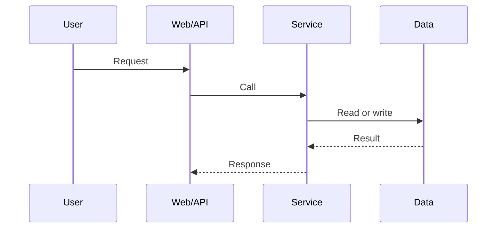

# Feature Document Template

Default target path: `raw/features/<FeatureName>特性文档.md`

Read `section-examples.md` before drafting. Keep the numbered sections below unless the user explicitly asks to trim them. If a section does not apply, write `None` or `Not applicable` instead of leaving it blank.

````md
## 1. Feature Summary

### 1.1 Overview

- Business goal:
- User value:
- System role:

### 1.2 Scope

- Covered in this document:
- Out of scope:

### 1.3 Entry Anchors

|Type|Value|Why it is the anchor|
|---|---|---|
|API URL|`/api/example`|Provided by the user or found in code|
|Key file|`path/to/file`|Tracing entry point|
|Key function|`func_name`|Tracing entry point|
|Page path / route|`/page/path`|Frontend entry point|

## 2. Core Capabilities

### 2.1 <Capability A>

- Capability summary:
- Entry trigger:
- Key processing:
- Output / side effects:
- Key constraints:
- Key code:

### 2.2 <Capability B>

- Capability summary:
- Entry trigger:
- Key processing:
- Output / side effects:
- Key constraints:
- Key code:

## 3. Interaction Flows

Provide 1 to 3 primary flows. For medium or higher complexity features, prefer at least 2 flows. Each flow must include goal, start, end, and critical branches, not only Mermaid.

### 3.1 <Primary Flow Name>

**Flow goal**:

**Start**:

**End**:



**Critical branches**:

- Branch A:
- Branch B:

## 4. Constraints and Conditions

1. Permission or role limits:
2. State or context limits:
3. Feature flags or environment dependencies:
4. Idempotency / concurrency rules:
5. Error or degradation behavior:

## 5. Module Design

### 5.1 <Module Name> Module

**Module responsibility**:

**Process / entry information**:

- Process name:
- Startup mode:
- Entry file:
- Entry function:

**Design purpose**:

**Core methods**:

|Method|Responsibility|Key design|
|---|---|---|
|`method_a`|Describe responsibility|Branching, cache, locking, retries, and so on|
|`method_b`|Describe responsibility|Branching, cache, locking, retries, and so on|

**Configuration / data paths / external dependencies**:

- Config files:
- Data paths:
- Cache / queue:
- External APIs:

**Implementation details**:

1. Detail A:
2. Detail B:
3. Detail C:

**Code example**:

```python
def example():
    pass
```

## 6. Interface Design

### 6.1 Internal Interfaces

|Interface|Protocol|Method|Description|
|---|---|---|---|
|`internal_call`|internal|`invoke()`|Describe how the internal capability is invoked|

### 6.2 External Interfaces / Message Formats

**Request or message format**:

```json
{
  "field": "value"
}
```

**Response or result format**:

```json
{
  "status": "ok"
}
```

### 6.3 Key File Paths

|File path|Description|Ownership / persistence|
|---|---|---|
|`/path/to/file`|What it is used for|memory / disk / repo file|

## 7. Specification Design

### 7.1 Type / Capability Definitions

|Type|Description|Level / state|Recovery / lifecycle|Notes|
|---|---|---|---|---|
|`type_a`|Describe it|`warning`|auto recovery|Additional notes|

### 7.2 Performance / Timing Specifications

|Metric|Default|Notes|
|---|---|---|
|Processing interval|`5s`|How the interval is used|
|Retry count|`5`|How retries work|

### 7.3 Constraint Rules

1. Input format rules:
2. State-machine rules:
3. Consistency rules:

## 8. Reliability and Availability Design

### 8.1 Reliability Design

- Deduplication or idempotency:
- Retry and backoff:
- Self-check and self-healing:
- Persistence / backup:

### 8.2 Availability Design

- Multi-channel / multi-copy:
- Failure degradation:
- Monitoring and alerting:

## 9. Key Code Locations

|Type|Location|Symbol|Responsibility|Upstream|Downstream|
|---|---|---|---|---|---|
|Entry file|`path/to/file`|`Class#method`|Entry responsibility|Caller|Callee|
|Core function|`path/to/file`|`func_name`|Core logic|Caller|Callee|
|External dependency|`path/to/file`|`client.call`|External integration|Caller|Callee|

## 10. Risks and Open Questions

- Open item A:
- Open item B:
- Doc-versus-code conflict:
````

Writing rules:

- Every conclusion must be backed by code or document evidence.
- Use user-visible capabilities or module names for section titles instead of generic labels.
- `## 5. Module Design` should cover at least 2 modules unless the feature truly has only one module.
- `## 6. Interface Design` and `## 7. Specification Design` must be present even when the answer is `None` or `To Be Confirmed`.
- Code examples must come from real implementation with only minimal trimming.
