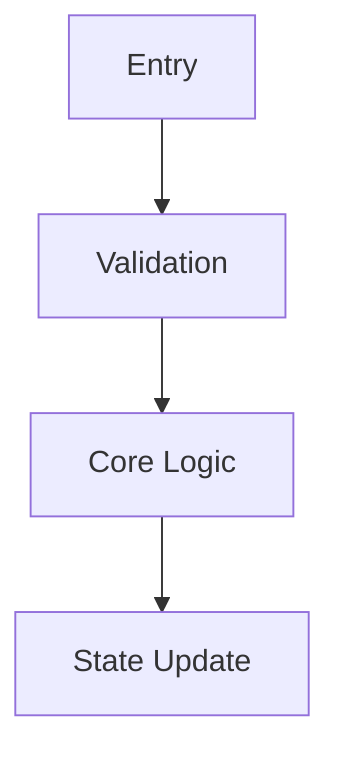

# DevWiki Workflow Writing Template

> Target path: `wiki/workflows/<slug>.md`  
> Positioning: a Workflow is the engineering implementation-path page. It carries implementation detail that Feature pages intentionally avoid.  
> Goal: help developers and agents quickly understand code entry points, call chains, key logic, state reads/writes, change impact, and validation strategy.

---

## 1. Responsibility

A Workflow page should answer:

- Where is the code entry?
- Does the flow start from a request, task, thread, timer, event, or config change?
- What is the main call chain?
- Which classes, modules, or functions carry key logic?
- Where are important state/config/data read and written?
- How do code branches map to Feature rules?
- What does a change affect?
- How should the change be tested?

A Workflow page should not contain:

- full business background;
- long product explanation;
- capability value;
- customer-facing usage docs;
- full troubleshooting runbook;
- detailed design repetition unrelated to code.

Put those details in:

- `wiki/features/<slug>.md` for functional goals, behavior, rules, boundaries, and acceptance concerns;
- `wiki/capabilities/<slug>.md` for capability value and boundary;
- `wiki/troubleshooting/<slug>.md` for symptoms, logs, diagnosis paths, and fixes;
- `raw/` for full source documents.

---

## 2. Workflow / Feature Boundary

Short distinction:

```text
Feature = functional behavior and rules
Workflow = implementation path and code
```

| Content | Feature | Workflow |
|---|---|---|
| Functional goal | detailed | may link |
| User scenario | detailed | do not expand |
| Key business rule | detailed | map to code branches |
| Config impact | detailed | read/validation/delivery/storage locations |
| Status/role meaning | functional meaning | how code checks and updates it |
| Decision table | functional rules | implementation path and order |
| Call chain | do not write | detailed |
| File path / function name | do not write | detailed |
| Change impact | functional impact | code impact and regression scope |
| Testing | acceptance concerns | test entry, validation steps, related cases |

---

## 3. Writing Rules

### 3.1 Start From Feature

Workflow should not exist alone. Each Workflow should point back to one or more Features:

```yaml
features:
  - "<feature-slug>"
```

Before writing, confirm:

- which Feature it serves;
- which functional rule it explains;
- whether it really needs a separate page.

### 3.2 Focus On Code Path

Workflow may reference Feature rules, but must not copy the whole Feature.

Correct:

```markdown
This flow implements the "backup node backs off when split brain is detected" rule. Functional rule: [[feature-ha-brain-split]].
```

Incorrect:

```markdown
Copy every background paragraph, user scenario, and key rule from Feature.
```

### 3.3 Code Evidence Must Be Concrete

Code paths, functions, classes, APIs, configs, and tests must come from verified code, pasted code, existing Wiki, or explicit retrieval results. Do not guess.

### 3.4 Separate Design Intent From Current Implementation

If design and code differ, state:

- design intent;
- current implementation;
- difference;
- whether human confirmation is needed.

---

## 4. Recommended Template

```markdown
---
title: "<Workflow Name>"
slug: "<workflow-slug>"
status: draft
summary: "<one sentence explaining the implementation path>"
features:
  - "<feature-slug>"
related_workflows: []
sources:
  - path: "raw/designs/<source-file>.md"
    kind: design
    hash: ""
    title: ""
    confidence: medium
    notes: ""
code_refs:
  - path: "<code file path>"
    symbol: "<class/function/method/constant>"
    kind: "<class/function/method/constant/config/test>"
    confidence: medium
api_entries: []
test_refs: []
visibility: internal
confidence: medium
last_verified_at: YYYY-MM-DD
search_terms:
  - "<functional keyword>"
  - "<code keyword>"
---

# <Workflow Name>

## Summary

Use 3 to 6 bullets:

- which Feature this Workflow supports;
- which implementation path it explains;
- main entry point;
- key code module;
- typical change impact.

## Related Features

| Feature | Relation | Notes |
|---|---|---|
| `[[<feature-slug>]]` | supports / affects / implements |  |

## Entry Points

Common entries include API/CLI, timer, thread start, callback, config change, lifecycle event, service startup, or user operation.

| Entry Type | Location | Trigger | Notes |
|---|---|---|---|
|  |  |  |  |

## Call Chain

Use prose, list, or Mermaid:



## Key Logic

| Logic Point | Code | Notes |
|---|---|---|
|  |  |  |

Requirements:

- do not explain code line by line;
- keep only logic needed to understand and modify the feature;
- map key branches back to Feature rules.

## Feature Rule To Implementation Mapping

| Feature Rule | Implementation Location | Implementation Notes | Remarks |
|---|---|---|---|
|  |  |  |  |

Write "pending code verification" when a rule has no verified implementation location.

## Data And State

| Data / State | Read Location | Write Location | Lifecycle | Notes |
|---|---|---|---|---|
|  |  |  |  |  |

## Config And Parameter Handling

| Config / Param | Read | Validate | Store / Deliver | Behavior Impact |
|---|---|---|---|---|
|  |  |  |  |  |

## Error Handling

| Error / Branch | Code Location | Behavior | User / System Effect |
|---|---|---|---|
|  |  |  |  |

## Tests And Validation

| Test / Command | Scope | Expected Result | Notes |
|---|---|---|---|
|  |  |  |  |

## Change Impact

- Files likely affected:
- Features affected:
- Regression scope:
- Operational risk:

## Implementation Differences

Record any difference between design intent and current code.

## Source Notes

Explain source coverage, uncertainty, conflicts, and code verification state.

## Search Terms

List terms users and qmd are likely to search.
```
