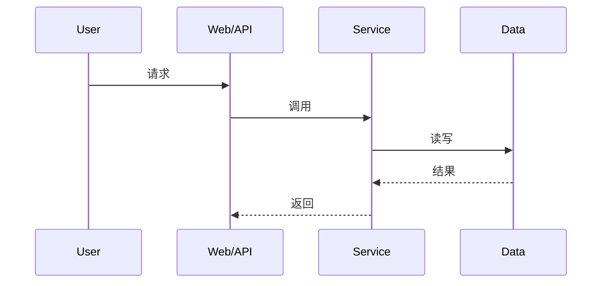

# 特性文档模板

目标文件默认写入：`raw/features/<特性名称>特性文档.md`

先阅读 `section-examples.md`，再按下面固定章节产出。除非用户明确要求裁剪，否则不要删除章节；如果某节不适用，明确写“无”或“不适用”，不要留空。

````md
## 1. 特性设计内容

### 1.1 特性概述

- 业务目标：
- 用户价值：
- 系统角色：

### 1.2 覆盖范围

- 本文覆盖：
- 本文不覆盖：

### 1.3 入口锚点

|类型|内容|定位说明|
|---|---|---|
|接口 URL|`/api/example`|用户提供或代码检索得到|
|关键文件|`path/to/file`|作为追链起点|
|关键函数|`func_name`|作为追链起点|
|页面路径/路由|`/page/path`|前端入口|

## 2. 核心特性

### 2.1 <子能力一>

- 能力说明：
- 触发入口：
- 关键处理：
- 输出 / 副作用：
- 关键约束：
- 关键代码：

### 2.2 <子能力二>

- 能力说明：
- 触发入口：
- 关键处理：
- 输出 / 副作用：
- 关键约束：
- 关键代码：

## 3. 交互流程图

至少给出 1 到 3 个最关键流程。中等及以上复杂度特性，优先给 2 个以上流程。每个流程都要写“流程目标 / 起点 / 终点 / 关键分支”，不能只贴 Mermaid。

### 3.1 <主流程名称>

**流程目标**：

**起点**：

**终点**：



**关键分支**：

- 分支一：
- 分支二：

## 4. 特性约束与条件

1. 权限或角色限制：
2. 状态或上下文限制：
3. 配置开关或环境依赖：
4. 幂等性 / 并发约束：
5. 异常 / 降级条件：

## 5. 模块设计

### 5.1 <模块名> 模块

**模块职责**：

**进程 / 入口信息**：

- 进程名：
- 启动方式：
- 入口文件：
- 入口函数：

**设计目的**：

**核心方法**：

|方法名|功能描述|关键设计|
|---|---|---|
|`method_a`|说明功能|说明关键分支、缓存、锁、重试等|
|`method_b`|说明功能|说明关键分支、缓存、锁、重试等|

**配置 / 数据目录 / 外部依赖**：

- 配置文件：
- 数据目录：
- 缓存 / 消息：
- 外部接口：

**关键实现细节**：

1. 细节一：
2. 细节二：
3. 细节三：

**关键代码示例**：

```python
def example():
    pass
```

## 6. 接口设计

### 6.1 内部接口

|接口|协议|方法|功能描述|
|---|---|---|---|
|`internal_call`|内部调用|`invoke()`|说明内部能力调用方式|

### 6.2 外部接口 / 消息格式

**请求或消息格式**：

```json
{
  "field": "value"
}
```

**返回或结果格式**：

```json
{
  "status": "ok"
}
```

### 6.3 关键文件路径

|文件路径|说明|归属 / 持久化|
|---|---|---|
|`/path/to/file`|说明用途|内存 / 数据盘 / 仓库文件|

## 7. 规格设计

### 7.1 类型 / 能力定义

|类型|说明|级别 / 状态|恢复策略 / 生命周期|备注|
|---|---|---|---|---|
|`type_a`|说明|`warning`|自动恢复|补充说明|

### 7.2 性能 / 时序规格

|指标|默认值|说明|
|---|---|---|
|处理周期|`5s`|说明该周期如何生效|
|重试次数|`5`|说明重试策略|

### 7.3 约束条件

1. 输入格式约束：
2. 状态机约束：
3. 数据一致性约束：

## 8. 可靠可用性设计

### 8.1 可靠性设计

- 去重或幂等：
- 重试与退避：
- 自检与自愈：
- 持久化 / 备份：

### 8.2 可用性设计

- 多通道 / 多副本：
- 故障降级：
- 监控与告警：

## 9. 关键代码定位

|类型|位置|符号|作用|上游|下游|
|---|---|---|---|---|---|
|入口文件|`path/to/file`|`Class#method`|入口职责|调用方|被调方|
|核心函数|`path/to/file`|`func_name`|核心逻辑|调用方|被调方|
|外部依赖|`path/to/file`|`client.call`|外部接口调用|调用方|被调方|

## 10. 风险与待确认事项

- 待确认项一：
- 待确认项二：
- 文档与代码冲突项：
````

写作要求：

- 结论必须附带代码或资料证据，未确认的内容要明确标识。
- 小节标题尽量贴近用户感知能力或模块名，避免使用“其他”“杂项”。
- `## 5. 模块设计` 至少覆盖 2 个模块，除非该特性确实只有单模块实现。
- `## 6. 接口设计` 和 `## 7. 规格设计` 即使信息不足，也要给出“未发现”或“待确认”。
- 代码示例必须来自真实实现，必要时可做最小裁剪，但不能改写语义。
