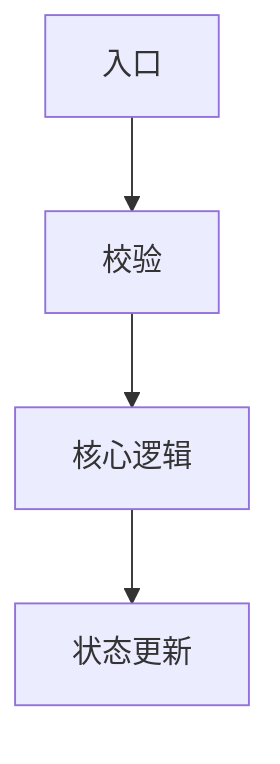

# DevWiki Workflow 编写模板

> 适用位置：`wiki/workflows/<slug>.md`  
> 定位：Workflow 是“工程实现路径页”，用于承接 Feature 中不展开的实现细节。  
> 目标：帮助开发者和 Agent 快速理解某个功能在代码中的入口、调用链、关键逻辑、状态读写、修改影响和验证方式。

---

## 一、Workflow 的职责

Workflow 页应该回答：

- 这个功能的代码入口在哪里？
- 请求、任务、线程、定时器或事件从哪里进入？
- 主要调用链怎么走？
- 哪些类、模块、函数承担关键逻辑？
- 关键状态、配置、数据从哪里读取、写到哪里？
- 代码实现和 Feature 描述的功能规则如何对应？
- 修改这块逻辑会影响哪些功能？
- 应该如何测试和验证？

Workflow 页不应该承担：

- 完整业务背景；
- 大段产品解释；
- 功能价值说明；
- 面向客户的使用说明；
- 完整排障 runbook；
- 与代码无关的详细设计复述。

这些内容应放到：

- `wiki/features/<slug>.md`：功能目标、核心行为、关键规则、边界和验收关注点；
- `wiki/capabilities/<slug>.md`：能力价值、能力边界、覆盖功能；
- `wiki/troubleshooting/<slug>.md`：故障现象、日志、诊断路径、修复建议；
- `raw/`：原始设计文档全文。

---

## 二、Workflow 与 Feature 的边界

一句话区分：

```text
Feature = 功能行为和规则是什么
Workflow = 实现路径和代码怎么走
```

| 内容 | Feature | Workflow |
|---|---|---|
| 功能目标 | 详细写 | 可引用 |
| 用户场景 | 详细写 | 不展开 |
| 关键业务规则 | 详细写 | 映射到代码分支 |
| 配置对行为的影响 | 详细写 | 说明读取、校验、下发、保存位置 |
| 状态/角色含义 | 功能级解释 | 说明代码如何判断和更新 |
| 决策表/策略矩阵 | 保留功能级规则 | 展开实现路径和判断顺序 |
| 调用链 | 不写 | 详细写 |
| 文件路径/函数名 | 不写 | 详细写 |
| 修改影响 | 只写功能影响 | 写代码影响、回归范围 |
| 测试方式 | 写验收关注点 | 写测试入口、验证步骤、相关用例 |

---

## 三、写作原则

### 3.1 先从 Feature 进入

Workflow 不应孤立存在。  
每个 Workflow 应该能回到一个或多个 Feature：

```yaml
features:
  - "<feature-slug>"
```

写 Workflow 前应先确认：

- 它服务哪个 Feature；
- 它解释的是哪个功能规则的实现路径；
- 它是否真的需要独立成页。

---

### 3.2 聚焦代码路径，不重复功能说明

Workflow 可以引用 Feature 的规则，但不要完整复制 Feature。

正确写法：

```markdown
该流程实现 Feature 中的“backup 双主退让”规则。功能级规则见：[[feature-ha-brain-split]]
```

错误写法：

```markdown
完整复制 Feature 里的所有背景、用户场景和关键规则……
```

---

### 3.3 代码证据必须明确

如果写入代码路径、函数、类、接口、配置文件、测试文件，必须来自：

- 已核对代码；
- 用户提供的代码片段；
- 已有 Wiki；
- 明确的检索结果。

不能凭猜测编造代码路径。

`code_refs` 必须按文件归并：

- 同一个 `path` 只能出现一条 `code_refs`。
- 顶层 `note` 必须是文件级职责，不写每个方法的说明。
- `symbols` 是关键入口索引，不是文件内方法清单。
- `symbols` 最多 4 个，只列关键入口。
- 不得为了完整性列出文件内所有方法。
- `symbols` 使用 `<symbol>#<kind>: "<短说明>"` 格式，不再维护独立的 symbol 说明 map。

---

### 3.4 区分“设计意图”和“当前实现”

如果设计文档和代码实现不一致，Workflow 要明确标记：

- 设计意图是什么；
- 当前实现是什么；
- 差异在哪里；
- 是否需要人工确认。

---

## 四、推荐模板

```markdown
---
title: "<工程流程名>"
slug: "<workflow-slug>"
status: draft
summary: "<一句话说明该 workflow 解释哪条实现路径>"
features:
  - "<feature-slug>"
related_workflows: []
sources:
  - path: "raw/designs/<source-file>.md"
    kind: design
    hash: ""
    title: ""
    confidence: medium
    notes: ""
code_refs:
  - path: "<代码文件路径>"
    kind: file
    note: "<文件级职责>"
    confidence: medium
    symbols:
      "<关键类/函数/方法/常量>#<class/function/method/constant/handler/config/task>": "<关键入口短说明>"
api_entries: []
test_refs: []
visibility: internal
confidence: medium
last_verified_at: YYYY-MM-DD
search_terms:
  - "<中文关键词>"
  - "<代码关键词>"
---

# <工程流程名>

## 摘要

用 3 到 6 条说明该 Workflow 的工程定位：

- 它对应哪个 Feature；
- 解释哪条实现路径；
- 主要入口是什么；
- 关键代码模块是什么；
- 修改这里通常会影响什么。

## 关联功能

列出该 Workflow 支撑或影响的 Feature。

| Feature | 关系 | 说明 |
|---|---|---|
| `[[<feature-slug>]]` | 支撑 / 影响 / 实现 |  |

## 入口点

说明代码从哪里进入。

常见入口包括：

- API / CLI；
- 定时任务；
- 线程启动；
- 消息回调；
- 配置变更；
- 生命周期事件；
- 系统服务启动；
- 用户操作。

| 入口类型 | 入口位置 | 触发条件 | 说明 |
|---|---|---|---|
|  |  |  |  |

## 调用链

用文字、列表或 Mermaid 描述主要调用链。



也可以使用列表：

1. `<入口函数/接口>` 接收请求或触发事件；
2. 调用 `<方法/模块>` 完成配置读取或状态判断；
3. 调用 `<方法/模块>` 执行核心动作；
4. 写入状态或返回结果。

## 关键逻辑

说明最重要的代码逻辑和判断分支。

| 逻辑点 | 对应代码 | 说明 |
|---|---|---|
|  |  |  |

写作要求：

- 不要逐行解释代码；
- 只保留理解功能和修改代码必须知道的逻辑；
- 关键判断要能映射到 Feature 的关键规则。

## 功能规则到实现的映射

把 Feature 中的关键规则映射到代码实现。

| Feature 规则 | 实现位置 | 实现说明 | 备注 |
|---|---|---|---|
|  |  |  |  |

如果某条 Feature 规则尚未找到代码实现，写入“待代码确认”。

## 数据与状态

说明代码读取、写入、更新的重要数据或状态。

| 数据 / 状态 | 读取位置 | 写入位置 | 生命周期 | 说明 |
|---|---|---|---|---|
|  |  |  |  |  |

包括但不限于：

- 配置项；
- 数据库字段；
- 状态文件；
- flag；
- 缓存；
- 内存计数；
- 线程状态；
- 外部接口返回状态。

## 配置与参数处理

如果该流程涉及配置读取、校验、同步、下发、默认值处理，写在这里。

| 配置 / 参数 | 处理位置 | 校验规则 | 行为影响 |
|---|---|---|---|
|  |  |  |  |

## 异常与恢复实现

说明代码如何处理异常、失败、超时、恢复、回滚、自愈。

| 场景 | 实现位置 | 处理动作 | 说明 |
|---|---|---|---|
|  |  |  |  |

## 并发、时序与可靠性

仅当流程涉及线程、定时器、并发、锁、重试、超时、防抖、保护窗口时填写。

| 机制 | 实现位置 | 行为 | 风险 |
|---|---|---|---|
|  |  |  |  |

## 对外接口与集成点

如果 Workflow 解释 API、CLI、服务间调用或第三方集成，在这里写工程入口和交互方式。

| 接口 / 集成点 | 方向 | 实现位置 | 说明 |
|---|---|---|---|
|  |  |  |  |

## 代码引用

列出已核对的代码引用。`code_refs` 以文件为粒度；同一文件内的关键 symbol 只作为入口索引，不列全量方法。

| 路径 | 文件级职责 | 关键入口 symbols（最多 4 个） | 置信度 |
|---|---|---|---|
|  |  |  |  |

类型示例：

- class
- module
- method
- function
- constant
- config
- migration
- test

## 测试引用

列出相关测试、验证脚本或建议补充的测试。

| 测试位置 | 覆盖内容 | 说明 |
|---|---|---|
|  |  |  |

如果没有现成测试，写“待补充”。

## 修改影响

说明修改该流程可能影响的功能、配置、数据、接口或排障路径。

| 修改点 | 可能影响 | 风险等级 | 建议验证 |
|---|---|---|---|
|  |  |  |  |

## 代码核对结论

说明设计与当前实现是否一致。

- 已确认一致：
- 与设计不一致：
- 仅设计提到但代码未确认：
- 代码存在但设计未提到：
- 待人工确认：

## 相关排障

列出相关 troubleshooting 页面。

- `[[<troubleshooting-slug>]]`

## 来源说明

说明来源、代码证据、冲突和不确定内容。

- 来源：
- 代码证据：
- 冲突：
- 不确定：
- 待确认：

## 检索词

用于 qmd 词法检索。包含中文别名、代码符号、配置项、接口名、状态名等。

- ...
```

---

## 五、可选扩展小节

以下小节按需使用。

### 状态机实现

适用于状态驱动流程。

| 状态 | 判断位置 | 进入条件 | 离开条件 | 行为 |
|---|---|---|---|---|
|  |  |  |  |  |

### 决策表实现

适用于条件矩阵或策略分支较多的流程。

| 条件 | 实现位置 | 动作 | 对应 Feature 规则 |
|---|---|---|---|
|  |  |  |  |

### 线程或任务生命周期

适用于后台线程、定时任务、守护进程。

| 阶段 | 触发条件 | 实现位置 | 说明 |
|---|---|---|---|
| 启动 |  |  |  |
| 运行 |  |  |  |
| 停止 |  |  |  |
| 重启 / 恢复 |  |  |  |

### 数据迁移或升级实现

适用于升级、回退、兼容字段、历史数据补齐。

| 场景 | 实现位置 | 处理方式 | 风险 |
|---|---|---|---|
|  |  |  |  |

---

## 六、设计信号抽取

生成 Workflow 前，Agent 应先从 Feature、原始设计和代码中抽取工程信号：

```markdown
## 工程信号

### 关联 Feature

### 功能规则

### 入口点

### 调用链

### 关键逻辑

### 状态读写

### 配置处理

### 数据持久化

### 接口与集成

### 异常与恢复

### 并发 / 线程 / 时序

### 代码引用

### 测试引用

### 修改影响

### 设计与实现差异

### 待确认问题
```

工程信号用于防遗漏，不代表 Workflow 必须生成同名小节。

---

## 七、保留策略

### 7.1 必须进入 Workflow

以下内容如果存在，通常应进入 Workflow：

- 代码入口；
- 调用链；
- 关键类、模块、函数；
- 关键状态读写位置；
- 配置读取、校验、同步或下发位置；
- 重要代码分支；
- 异常、超时、恢复、自愈的实现位置；
- 线程、定时器、并发、锁、重试的实现；
- 与 Feature 关键规则的代码映射；
- 修改影响和回归验证建议。

### 7.2 不应进入 Workflow

以下内容一般不写进 Workflow：

- 大段业务价值说明；
- 面向客户的功能介绍；
- 完整产品背景；
- 不涉及代码的详细设计章节；
- 与实现无关的截图说明；
- 已在 Feature 中维护的完整功能规则。

### 7.3 可以只链接

以下内容可以只链接，不重复展开：

- Feature 功能说明；
- Capability 能力边界；
- Troubleshooting 诊断路径；
- 原始设计全文。

---

## 八、Workflow 质量检查

落盘前逐项检查：

- 是否明确关联 Feature；
- 是否说明入口点；
- 是否说明主调用链；
- 是否列出关键逻辑；
- 是否把 Feature 的关键规则映射到代码；
- 是否说明关键状态和数据如何读写；
- 是否说明配置如何读取、校验、同步或下发；
- 是否说明异常、恢复、超时或重试的实现；
- 如果涉及线程/任务，是否说明生命周期；
- 是否列出已核对代码引用；
- 是否列出测试引用或待补测试；
- 是否说明修改影响和验证建议；
- 是否标记设计与实现差异；
- 是否避免重复 Feature 的完整功能说明；
- 是否没有编造代码路径、函数或模块名。
