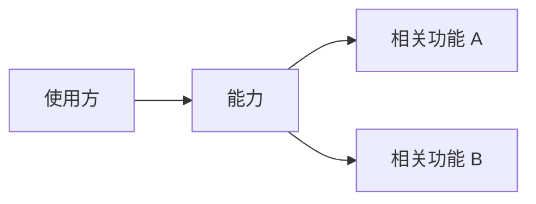
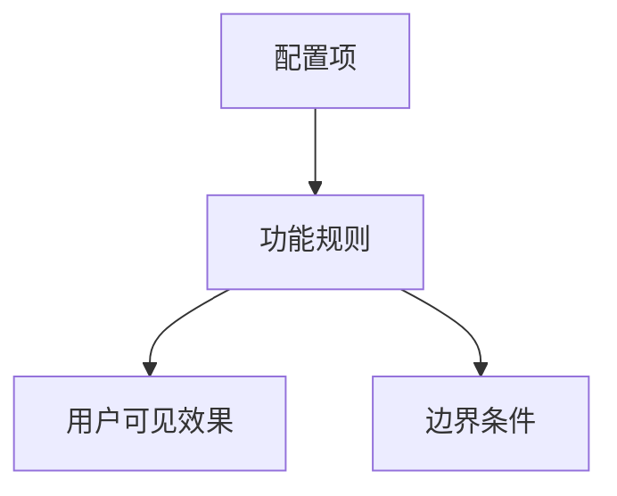
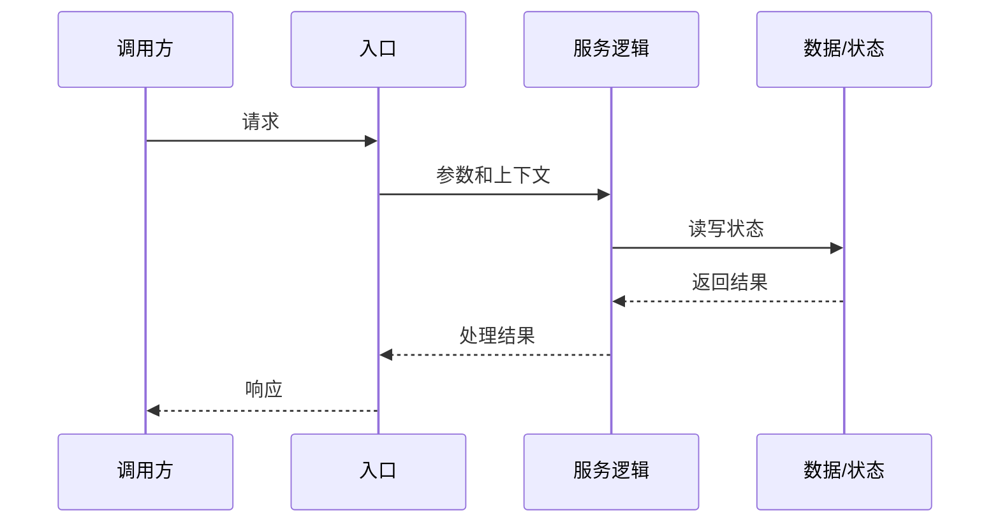

# /devwiki-query

> 先阅读通用约束：
> - `references/evidence-grounding.md`
> - `references/zatools-qmd.md`
> - 涉及代码追踪、代码归因或实现核对时，再读 `references/code-tracing.md`
> - 涉及写入、保存回答或沉淀新结论时，再读 `references/mutation-safety.md`

基于 Project Brain 回答问题。不要凭空回答项目事实；先查 DevWiki，再按需核对代码；每个关键结论都要能追溯来源。

## Inputs

- `question`：自然语言问题
- `role`（可选）：developer / internal_non_developer / external_user
- `format`（可选）：markdown / table / bullets / timeline
- `save-output`（可选）：仅当用户明确要求保存回答时使用

## Outputs

- 先给出语义识别结果：capability / feature / workflow / troubleshooting / public_answer / compare
- 按语义类型输出对应形态的带来源回答
- 命中的 capability / feature / workflow / troubleshooting
- 必要的 Mermaid 图示：能力架构图、功能流程图、对接图、调用链图等
- 知识缺口、冲突和待确认项
- 必要的代码定位线索、修改影响和测试建议（仅当语义为 workflow、troubleshooting 或明确要求实现核对）
- 对外回答版本（仅当用户身份或问题场景要求 public 口径）
- 深入建议：如果用户要继续深入，建议下一步查看能力边界、功能配置、实现调用链、排障路径或修改影响中的哪一类

## DevWiki Interaction

### Reads

- `config/project.yaml`
- `config/search.yaml`
- `wiki/index.md`
- `wiki/glossary.md`
- `wiki/capabilities/*.md`
- `wiki/features/*.md`
- `wiki/workflows/*.md`
- `wiki/troubleshooting/*.md`
- 本地代码目录：仅当问题语义为 workflow、troubleshooting，或用户明确要求当前实现、代码定位、配置项定位、日志关键字定位、修改影响或排障核实时读取

### Writes

- 默认不写任何文件
- 只有用户明确要求保存回答或沉淀结论时，才允许：
  - CREATE `wiki/outputs/<query-slug>.md`
  - APPEND `wiki/log.md`

## Query Principles

必须做到：

1. 不凭空回答项目事实。
2. 先查 Wiki 和 raw 来源，再按需核对代码。
3. 每个关键结论都有来源。
4. 明确标记知识缺口。
5. 明确标记冲突。
6. 对开发者问题给出代码定位线索。
7. 对外部用户问题只使用 public 可见知识。
8. `zatools qmd` 只是召回工具，不是真相源。
9. 先识别语义，再决定检索目录、证据深度和回答形态。
10. capability / feature / workflow 是三种不同输出形态，不要在同一回答中默认混合展开。
11. capability 回答禁止直接展开代码、函数、文件路径、调用链、测试入口或修改方式。
12. feature 回答禁止直接展开代码、函数、文件路径、模块内部实现、调用链、测试入口或修改方式。
13. 只有 workflow / troubleshooting / 明确实现追问，才允许进入代码层面。
14. 如果用户只是在了解能力，不要给具体实现；只说明能力提供什么、适用场景、边界、使用入口和协作关系。

## 目录选择规则

| 用户意图 | 用户实际在问 | 优先目录 | 辅助目录 |
|---|---|---|---|
| 能力解释 | 提供什么能力、能解决什么问题、适合谁用、边界是什么、如何使用这类能力 | `wiki/capabilities/` | `wiki/features/` |
| 功能说明 | 功能是什么、怎么配置、实现什么效果、参数如何取值、功能如何联动、设计怎么流转 | `wiki/features/` | `wiki/capabilities/` |
| 实现说明 | 代码在哪里、调用链怎么走、接口怎么接、内部逻辑是什么、怎么改、影响哪些功能 | `wiki/workflows/` | `wiki/features/`, 之后才 `rg` |
| 故障排查 | 报错、不生效、怎么排查、怎么修复 | `wiki/troubleshooting/` | `wiki/workflows/`, `wiki/features/` |

典型顺序：

- 能力问题：`capabilities → features`
- 功能问题：`features → capabilities`
- 实现问题：`workflows → features → rg`
- 排障问题：`troubleshooting → workflows → features`

## 去重与权威来源规则

- 能力定义以 capability 页面为准。
- 功能规则、参数、联动和设计流转以 feature 页面为准。
- 调用链、关键逻辑、代码引用、修改影响和测试入口以 workflow 页面为准。
- 日志、错误码、排障步骤以 troubleshooting 页面为准。

其他页面如果出现重复内容，只能作为摘要和导航，不作为权威来源。

## Workflow

### Step 1: 意图识别与范围收敛

1. 读取 `config/project.yaml`，确定代码仓配置和默认语言。
2. 读取 `wiki/index.md`、`wiki/glossary.md`，建立全局上下文。
3. 判断用户身份：
   - 默认 `developer`
   - 用户说“客户、外部用户、官网、对外说明”时，按 `external_user`
   - 用户说“产品、测试、售前、支持、运维”时，按 `internal_non_developer`
4. 先判断问题语义层级，再判断问题类型。语义层级优先于输出格式：

```text
capability：用户想了解“有什么能力、能做什么、解决什么问题、能力边界、如何使用这类能力”
feature：用户想了解“某个功能怎么配置、有什么选项、产生什么效果、功能间如何联动、流程规则是什么”
workflow：用户想了解“代码怎么实现、入口在哪里、调用链、接口对接、数据流、怎么改、影响面、测试入口”
troubleshooting：用户想解决“报错、不生效、异常现象、诊断路径、修复建议”
public_answer：用户要求对外说明、客户口径、官网/文档口径
compare：用户要求比较两个能力、功能、方案或实现路径
```

5. 语义识别规则：

- 命中“能力、能做什么、提供什么、适用场景、边界、怎么使用这个能力”时，优先判为 `capability`。
- 命中“功能、配置、参数、开关、效果、规则、联动、流程、策略”时，优先判为 `feature`。
- 命中“实现、代码、函数、类、文件、接口、调用链、数据结构、怎么改、测试、日志打印点”时，优先判为 `workflow`。
- 命中“错误、失败、不生效、报错、排查、修复、日志、告警”时，优先判为 `troubleshooting`。
- 同一问题同时出现多个层级时，只回答用户显式要求的最高优先目标；不要主动把 capability 扩展到 workflow。
- 如果用户表达含糊，先用 1 到 3 个问题确认：“你想了解能力边界、功能配置，还是代码实现？”

6. 判断问题类型：

```text
explain_capability
explain_feature
locate_code
troubleshoot
compare
public_answer
design_detail
change_impact
```

如果 `wiki/index.md` 或 `wiki/glossary.md` 缺失，输出：

```text
当前 Project Brain 没有足够信息支持该结论。
```

并建议先执行：

```text
devwiki-ingest
```

### Step 2: 按语义召回候选资料

查询词来源：

1. 用户原始问题中的关键词、接口、配置项、错误码、日志片段、功能名。
2. `wiki/glossary.md` 中的术语、别名、注意事项。
3. `wiki/index.md` 中的 capability / feature / workflow / troubleshooting 入口。
4. 候选页面 frontmatter 和正文链接中的 capability / feature / workflow / troubleshooting 关系。

召回规则：

1. 根据“目录选择规则”确定首查目录。
2. 默认先本地搜索 DevWiki 文档层：首查目录、辅助目录、`wiki/index.md`、`wiki/glossary.md`，必要时再查 `raw/`。
3. 召回分档、低置信升档和 qmd fallback 统一遵守 `references/zatools-qmd.md`。
4. `zatools qmd search` 只作为候选排序；命中后必须读取真实 `wiki/` / `raw/` 页面，再按事实归属去重。
5. 对 `public_answer` 只读取 public 可见页面和可公开摘录，不读代码仓库。
6. 候选数量受控：top-K（K ≤ 12），优先读高相关页面。
7. 对 `capability`，最多把 feature 当作“覆盖功能/使用入口”的辅助证据，不展开 feature 内部配置细节，更不读取代码。
8. 对 `feature`，最多把 workflow 当作“实现入口已存在”的导航证据；如果用户没有问实现，不读取代码、不输出代码层面内容。
9. 对 `workflow`，优先读取 workflow 的 `code_refs`、`api_entries`、`test_refs`，再按需使用 `rg` 核对代码。
10. 对 `troubleshooting`，优先读取 troubleshooting，再读取相关 workflow 和 feature；需要确认运行时行为时才读代码。

如果 `qmd search/query` 报错、超时、collection 未注册、cache 不可写或模型缺失，按 `references/zatools-qmd.md` 降级为本地 Wiki 搜索，并在回答中明示“本轮 qmd 不可用，已降级”。

如果文档已经足够回答，就不要为了“更稳”再默认展开代码阅读。

### Step 3: 按需核对代码

以下情况必须核对代码：

- 问题语义识别为 `workflow`
- 用户问「在哪里」「哪个文件」「哪个函数」「哪个接口」「当前实现是不是这样」
- 用户要求修改建议、影响分析、配置项定位、日志关键字定位
- 排障问题必须确认运行时行为或日志出处
- wiki / raw 证据不足以支撑结论

以下情况禁止核对或输出代码层面内容，除非用户继续明确追问实现：

- `capability` 语义：不要输出代码路径、函数、类、调用链、接口实现、测试入口、修改建议。
- `feature` 语义：不要输出代码路径、函数、类、模块内部实现、调用链、测试入口、修改建议。
- `external_user` 语义：不要读取代码仓库，不输出内部实现或内部文件定位。

核对顺序：

1. 优先读取相关 workflow 页中的 `code_refs`、`api_entries`、`test_refs`。
2. 若已有明确代码锚点，用 `rg` 定向搜索。
3. 如果没有候选目录，再扩大到配置代码仓根。
4. 至少确认入口文件、关键函数、接口注册点、配置读取点、日志打印点或测试入口中的一层证据。

### Step 4: 按语义组织回答

必须先给出一句简短语义判断，例如：

```markdown
我按「能力」来回答：你问的是系统提供什么能力、适用范围和使用方式，不展开代码实现。
```

不同语义使用不同回答结构，不要混合。

#### Capability 回答形态

适用于用户只想了解能力、能力边界或如何使用能力。

回答重点：

- 这项能力提供什么
- 面向哪些角色或场景
- 能解决什么问题
- 能力边界：包含什么、不包含什么
- 如何使用：入口、前置条件、与哪些功能协作
- Mermaid：优先给能力架构图、能力协作图或对接图

禁止输出：

- 代码路径、函数名、类名、handler、模块内部实现
- 调用链、数据结构、测试入口、修改建议
- “某文件中实现了……”这类代码层面表述

推荐结构：

````markdown
## 语义识别

## 结论

## 能力说明

## 使用方式

## 能力边界

## 架构 / 对接图



## 依据

## 待确认项

## 深入建议
````

#### Feature 回答形态

适用于用户询问具体功能、配置、参数、规则、效果和功能联动。

回答重点：

- 功能是什么
- 如何配置或使用
- 参数、开关、取值范围、默认行为
- 配置后实现什么效果
- 功能间如何联动
- 正常流程、异常语义、约束和边界
- Mermaid：优先给功能流程图、配置生效图、状态流转图或功能联动图

禁止输出：

- 代码路径、函数名、类名、handler、模块内部实现
- 调用链、测试入口、修改建议
- “需要改某个函数/文件”这类实现层面建议

推荐结构：

````markdown
## 语义识别

## 结论

## 功能说明

## 配置 / 参数

## 生效效果

## 功能流程 / 联动图



## 依据

## 待确认项

## 深入建议
````

#### Workflow 回答形态

适用于用户明确询问实现、代码定位、接口对接、调用链、数据流、怎么改或影响面。

回答重点：

- 实现入口和关键代码定位
- 调用链、数据流、状态读写、外部依赖
- 关键逻辑和边界条件
- 修改影响和测试建议
- Mermaid：优先给调用链图、数据流图、接口对接图或时序图

推荐结构：

````markdown
## 语义识别

## 结论

## 实现入口

## 调用链 / 数据流

## 关键逻辑

## 对接 / 调用图



## 代码定位线索

## 修改影响 / 测试建议

## 依据

## 冲突 / 待确认项

## 深入建议
````

#### Compare 回答形态

比较时仍然必须保持层级一致：

- capability 对 capability：比较能力目标、场景、边界和协作关系。
- feature 对 feature：比较配置、规则、效果、联动和限制。
- workflow 对 workflow：比较实现入口、调用链、数据流、影响面和测试入口。
- 不要把一个能力和一个实现直接混比；如用户问题混杂，先拆分或确认。

#### 深入建议要求

回答最后必须给出一段简短引导，但不要替用户继续展开：

```markdown
如果需要继续深入，建议下一步选择一个方向：能力边界、功能配置、实现调用链、排障路径或修改影响。
```

### Step 5: 按需沉淀答案

只有用户明确要求保存回答、沉淀结论、写入报告时，才允许写 `wiki/outputs/<query-slug>.md` 并追加 `wiki/log.md`。保存前先给出拟写路径和摘要。

## Error Handling

- **Wiki 证据不足**：说明不足点，建议执行 `devwiki-ingest` 或 `devwiki-code-to-doc`。
- **检索低置信**：停止扩散，向用户问 1 到 3 个具体问题。
- **文档与代码冲突**：明确列出「文档描述」和「代码现状」。
- **需要当前实现但未核对代码**：不要给确定结论。
