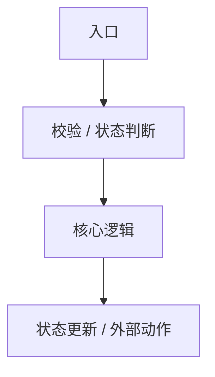

# DevWiki Workflow 编写模板

> 适用位置：`wiki/workflows/<slug>.md`  
> 定位：Workflow 是工程实现路径页，用于承接 Topic 中不展开的实现细节。  
> 目标：帮助开发者和 Agent 快速理解某个主题在代码中的入口、关键逻辑、状态读写、修改影响和验证方式。

```markdown
---
title: "<工程流程名>"
slug: "<workflow-slug>"
kind: workflow
status: draft
summary: "<一句话说明该 workflow 解释哪条实现路径>"
topics:
  - "<topic-slug>"
related_workflows: []
troubleshooting: []
sources: []
visibility: internal
confidence: medium
last_verified_at: YYYY-MM-DD
search_terms: []
---

# <工程流程名>

<!-- devwiki:section id=card -->
## 工程卡

- 支撑 Topic：
  -
- 工程定位：
- 适合回答：
  - 代码在哪里
  - 入口在哪里
  - 规则如何映射实现
  - 修改影响是什么
- 不适合回答：
  - 完整业务背景
  - 面向客户的功能介绍
  - 未经核对的代码猜测
<!-- /devwiki:section -->

<!-- devwiki:section id=core -->
## 关键代码与逻辑

| 路径 | 文件职责 | 关键入口 / Symbol | 关键逻辑点 | 证据状态 | 说明 |
|---|---|---|---|---|---|
|  |  |  |  | 已核对 / 待确认 |  |

写作要求：

- 按文件归并；
- 一个文件只写一行；
- 关键入口最多列 8 个；
- 只列关键文件、关键入口和关键逻辑点；
- 辅助函数、普通校验、局部工具函数和顺手读到的方法不要列入表格；
- 不列全量方法或完整调用树；
- 不写未经核对的代码路径；
- 需要补充核对的内容写“待确认”。

### 入口与触发

| 入口类型 | 入口位置 | 触发条件 | 说明 |
|---|---|---|---|
| API / CLI / 定时任务 / 线程 / 回调 / 配置变更 / 生命周期 |  |  |  |

### 规则到实现的映射

| Topic 规则 | 实现位置 | 实现说明 | 备注 |
|---|---|---|---|
|  |  |  |  |

### 修改影响

| 修改点 | 可能影响 | 风险等级 | 建议验证 |
|---|---|---|---|
|  |  | 高 / 中 / 低 |  |

### 测试与验证

| 测试位置 / 方法 | 覆盖内容 | 说明 |
|---|---|---|
|  |  |  |
<!-- /devwiki:section -->

<!-- devwiki:section id=explain -->
## 实现说明

### 调用链



### 数据与状态

| 数据 / 状态 | 读取位置 | 写入位置 | 生命周期 | 说明 |
|---|---|---|---|---|
|  |  |  |  |  |

### 配置与参数处理

| 配置 / 参数 | 处理位置 | 校验规则 | 行为影响 |
|---|---|---|---|
|  |  |  |  |

### 异常与恢复

| 场景 | 实现位置 | 处理动作 | 说明 |
|---|---|---|---|
|  |  |  |  |

### 并发、时序与可靠性

仅当涉及线程、定时器、并发、锁、重试、超时、防抖、保护窗口时填写。

### 设计与实现差异

- 已确认一致：
- 与设计不一致：
- 仅设计提到但代码未确认：
- 代码存在但设计未提到：
- 待人工确认：

### 来源说明

- 来源：
- 代码证据：
- 冲突：
- 不确定：
- 待确认：
<!-- /devwiki:section -->
```

## 质量检查

- Workflow 必须关联至少一个 Topic。
- Workflow 不复制 Topic 的完整功能说明。
- 代码路径、函数、类、配置文件必须有证据。
- 未核对代码不得写成确定事实。
- 代码定位与关键逻辑统一写入 `core` section，不写入 frontmatter。
- 只列关键文件、关键入口和关键逻辑点；不列全量方法、辅助函数或普通校验函数。
- Workflow frontmatter 不再放 `code_refs`、`symbols`、`api_entries`、`test_refs`。
