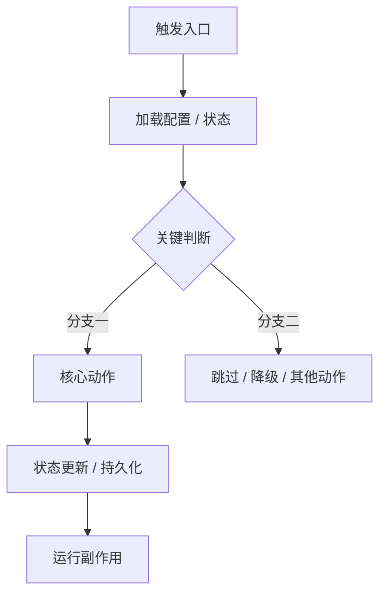

# DevWiki Workflow 编写模板

> 适用位置：`wiki/workflows/<slug>.md`  
> 定位：Workflow 是工程实现路径页，用于承接 Topic 中不展开的实现细节。  
> 目标：帮助开发者和 Agent 快速理解某个主题在代码中的入口、关键实现机制、状态变化、运行副作用和修改影响。

## 写作原则

- `card` 用于判断是否命中。
- `core` 用于快速定位代码和判断修改影响。
- `explain` 用于理解实现机制，覆盖高频问答，不写成长篇详细设计。
- 不写测试方法、测试用例和测试位置。
- 不写参数校验细节、复杂函数内部步骤和辅助函数清单。

```markdown
---
title: "<工程流程名>"
slug: "<workflow-slug>"
kind: workflow
status: draft
summary: "<一句话说明该 workflow 解释哪条实现路径>"
topics:
  - "<topic-slug>"
related_workflows: []
troubleshooting: []
sources: []
visibility: internal
confidence: medium
last_verified_at: YYYY-MM-DD
search_terms: []
---

# <工程流程名>

<!-- devwiki:section id=card -->
## 工程卡
- 支撑 Topic：
  -
- 工程定位：
  -
- 适合回答：
  - 
- 不适合回答：
  -
<!-- /devwiki:section -->

<!-- devwiki:section id=core -->
## 关键代码与逻辑

| 路径 | 文件职责 | 关键入口 / 触发方式 | 关键机制点 | 修改影响 | 证据状态 |
|---|---|---|---|---|---|
|  |  |  |  |  | 已核对 / 待确认 |

写作要求：

- 按文件归并；
- 一个文件只写一行；
- 关键入口最多列 8 个；
- 只列关键文件、关键入口和关键逻辑点；
- `关键入口 / 触发方式` 用来说明从哪里进入，例如 API、CLI、定时任务、线程、回调、配置变更或生命周期事件；
- `关键机制点` 用来说明该文件承担的核心机制，例如状态判断、配置生成、调度、持久化、运行副作用触发；
- 辅助函数、普通校验、局部工具函数和顺手读到的方法不要列入表格；
- 不列全量方法或完整调用树；
- 不写未经核对的代码路径；
- 不写测试位置、测试方法、测试用例；
- 需要补充核对的内容写“待确认”。
<!-- /devwiki:section -->

<!-- devwiki:section id=explain -->
## 实现机制说明

### 关键流程图



写作要求：

- 只画主流程和关键分支；
- 不画完整调用树；
- 不把每个函数都画成节点；
- 如果无法确认某个环节，节点标记为“待确认”。

### 机制摘要

用 3 到 6 条说明该 workflow 的实现机制：

- 入口从哪里来；
- 哪些模块协作完成主流程；
- 核心判断或调度机制是什么；
- 哪些状态会变化；
- 哪些运行副作用会发生；
- 修改时最需要关注什么。

### 模块协作

| 模块 / 层级 | 职责 | 输入 | 输出 / 副作用 |
|---|---|---|---|
|  |  |  |  |

写作要求：

- 只写参与主机制的模块；
- 不写辅助函数；
- 不展开参数校验细节；
- 每行必须说明输入和输出或副作用。

### 主流程

用 5 到 8 步说明主流程：

1. 
2. 
3. 
4. 
5. 

写作要求：

- 按机制推进顺序写；
- 只写主路径和关键分支；
- 不写字段级参数处理；
- 不写复杂函数内部步骤。

### 关键机制点

| 机制点 | 参与模块 | 状态 / 副作用 | 说明 |
|---|---|---|---|
|  |  |  |  |

写作要求：

- 机制点必须影响功能行为、状态变化、运行配置或修改风险；
- 普通参数校验、格式转换、局部工具函数不算机制点；
- 每个机制点要说明为什么值得关注。

### 状态与副作用

仅写重要状态变化和运行副作用。

| 状态 / 副作用 | 触发条件 | 发生位置 | 影响 |
|---|---|---|---|
|  |  |  |  |

### 修改关注点

- 修改入口逻辑时：
- 修改状态判断时：
- 修改配置生成或运行副作用时：
- 修改持久化或状态更新时：
- 尚需确认：
<!-- /devwiki:section -->


## 质量检查

- Workflow 必须关联至少一个 Topic。
- Workflow 不复制 Topic 的完整功能说明。
- 代码路径、函数、类、配置文件必须有证据。
- 未核对代码不得写成确定事实。
- 代码定位与关键逻辑统一写入 `core` section，不写入 frontmatter。
- `入口与触发` 不再作为独立小节，必须合并到代码定位表。
- `规则到实现的映射` 不再作为独立小节；重要规则影响写入“关键机制点”。
- 只列关键文件、关键入口和关键逻辑点；不列全量方法、辅助函数或普通校验函数。
- `explain` 必须包含关键流程图。,只写实现机制，不写参数校验细节、复杂函数内部步骤和测试设计。
- Workflow frontmatter 不再放 `code_refs`、`symbols`、`api_entries`、`test_refs`。
